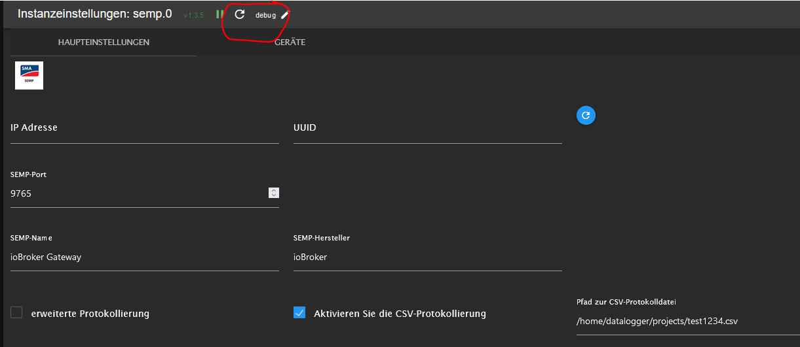
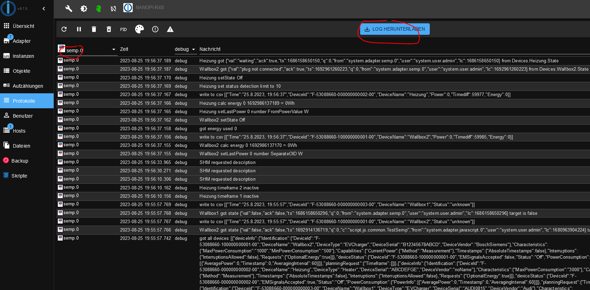
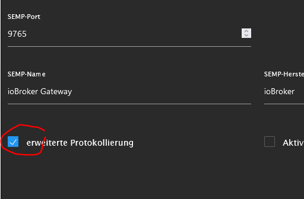

# Debug-Möglichkeiten

## ioBroker log

Die einfachste Möglichkeit, Fehler und Informationen über den Adapter zu finden, ist das debug log.
Dazu zunächts die Protokollstufe des Adapters auf debug stellen, den Adapter neu starten.

oder

Unter Protokolle findet man dann die logs. Der Filter hilft, die logs des Adapters zu finden.

Hier kann man auch das gesamte log als Textdatei herunterladen.

Wenn man noch die erweiterte Protokollierung aktiviert, wird jedes Telegram an den Homemanager zusätzlich im log
protokolliert. Das führt aber zu extrem umfangreichen logs und sollte nur kurzzeitig zur Fehlersuche aktiviert werden.

## csv Log
Da die ioBroker-logs sehr umfangreich sein können, hat dieser Adapter eine weitere Möglichkeit, die Daten,
die an den Homemanager gesendet wurden, zu loggen.

Dazu muss man das csv-Log aktivieren und einen Pfad angeben, wo das log gespeichert werden soll. Wenn nur ein Pfad 
angegeben wird, wird eine log-Datei pro Tag im angegebenen Pfad erzeugt. Die Datei wird nach 5 Tagen wieder gelöscht, so dass nur maximal
5 csv-logs im Pfad liegen. Wenn man einen Dateinamen mit angibt, wird in diese Datei geloggt.
*Achtung*: der Pfad muss auf dem System lokal erreichbar sein, auf dem die semp-Instanz läuft.

## SHM log

Der Homemanager erstellt ebenfalls logs. Die sind nicht ganz so einfach zu finden, helfen
aber oft, wenn oben genannte logs nicht mehr ausreichen.

siehe [Connection Assist](../connection_assist/connection_assist_de.md)
